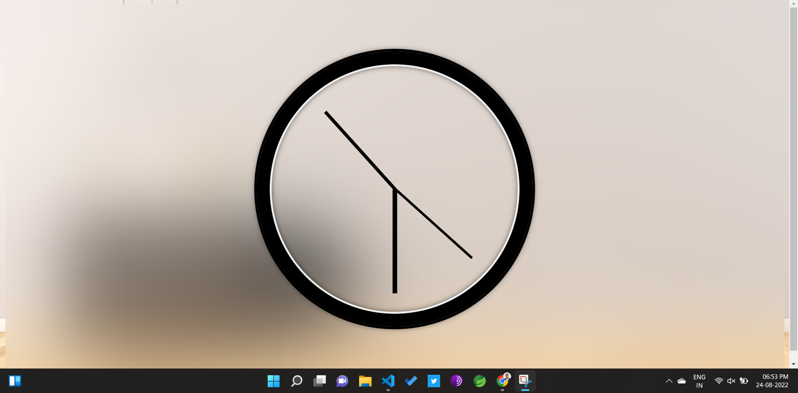

# ANALOG CLOCK 
## A analog clock is similar to wall clock.
## Time is in 12 Hr Format.
## It adjust its hands w.r.t. current system time.
#
## Tech stack 
- HTML
- CSS
- JS
# Demo

### Analog clock time is similar to system time

