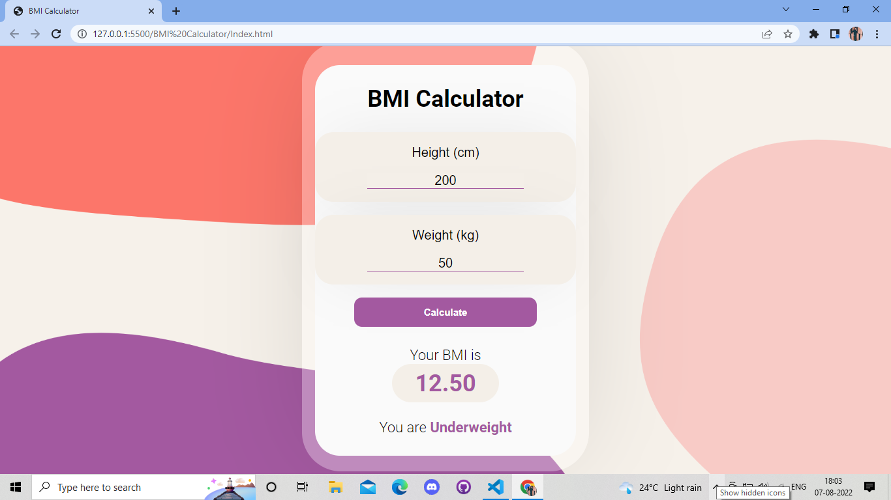

# BMI Calculator
A BMI Calculator which can calculate the BMI of the user and tell them whether they are Overweight, Underweight, Healthy or Obese. The calculator was built using HTML, CSS & Javascript, no framework is used. Also the Calculator is responsive.

# Tech Stack
HTML, CSS, JavaScript
# Screenshots

