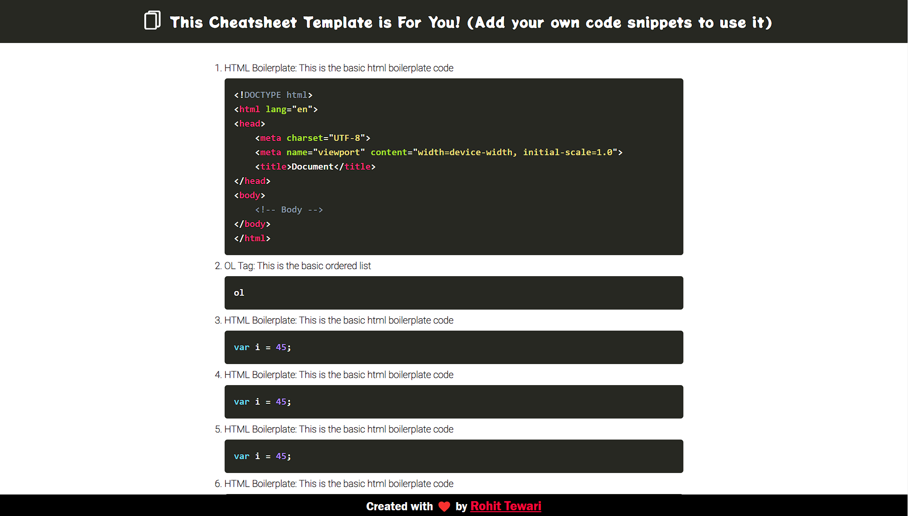

# Cheatsheet Template

This template allows users to create their own cheatsheet for copy/paste code snippets in their coding workflow. To use this template you just have to add your code snippets for any language you want and host the web page to access from anywhere.

##  Home Page View :

## Features
- Responsive UI
- Copy/Paste code snippets in your project source code
- Host the web page to access from anywhere

## Tech Stack used

### Frontend

### Backend

No backend required
  
## Developer

[Rohit Tewari](https://www.github.com/rtewari056)
