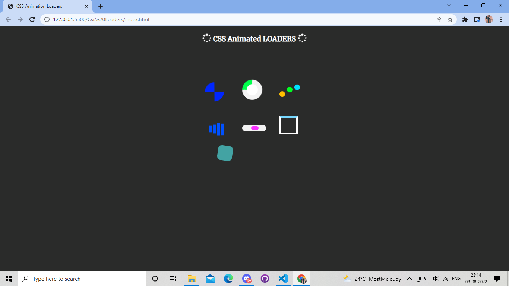

# CSS Animation Loaders
Various  CSS Animation Loaders which are notifications that reassure users that the system is still handling their request. When a user clicks on a link or button, the animation is displayed until the load process is complete.
# Tech Stack
HTML and CSS
# Screenshots

