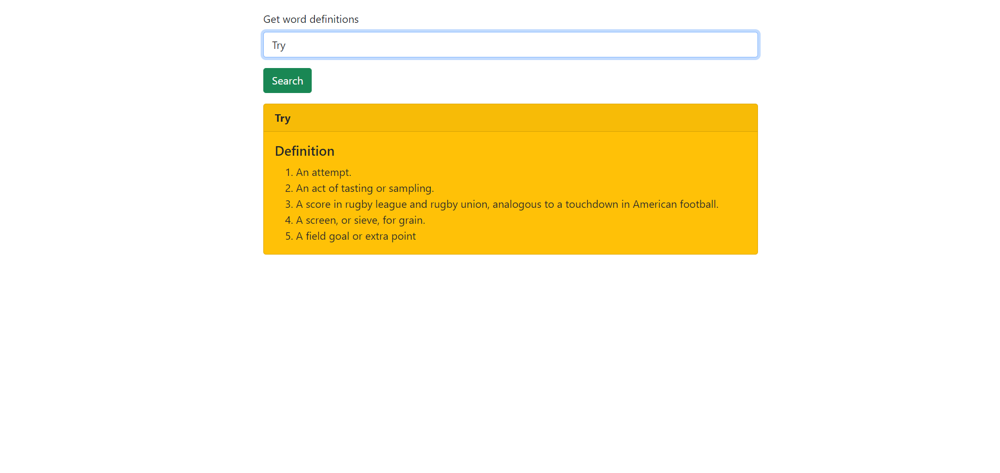

# Dictionary App

A Basic Webapp that searches the given word and gives you definition of that word. It uses Dictionary API to fetch word definitions.

##  Home Page View :

## Features
- Fully responsive
- Get word definition on a single click

## Tech Stack used

### Frontend

### Backend

No backend required
  
## Developer

[Rohit Tewari](https://www.github.com/rtewari056)
