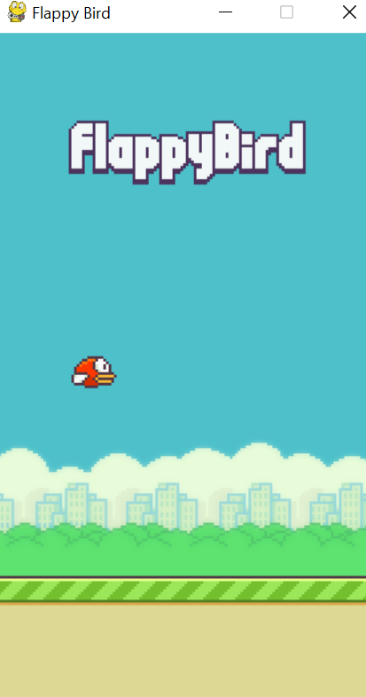
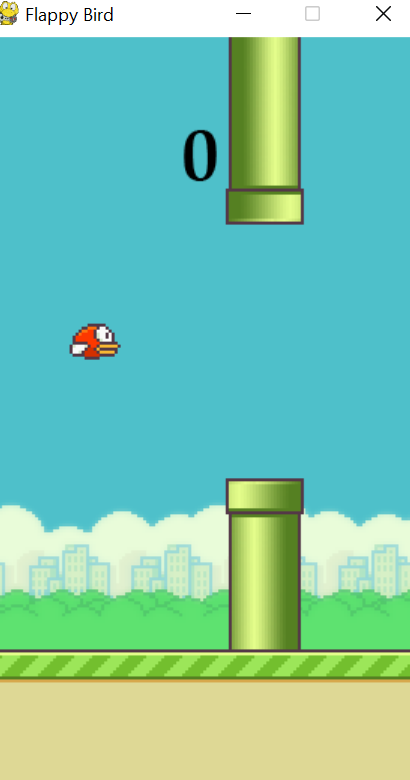

# FLAPPY BIRD 
## About
This is Flappy Bird clone. The player controls the bird, which moves persistently to the right.
 The main objective of the player is to gain the maximum points by defending the bird from hurdles.
This is build using Python and Pygame library.

## Screenshots

