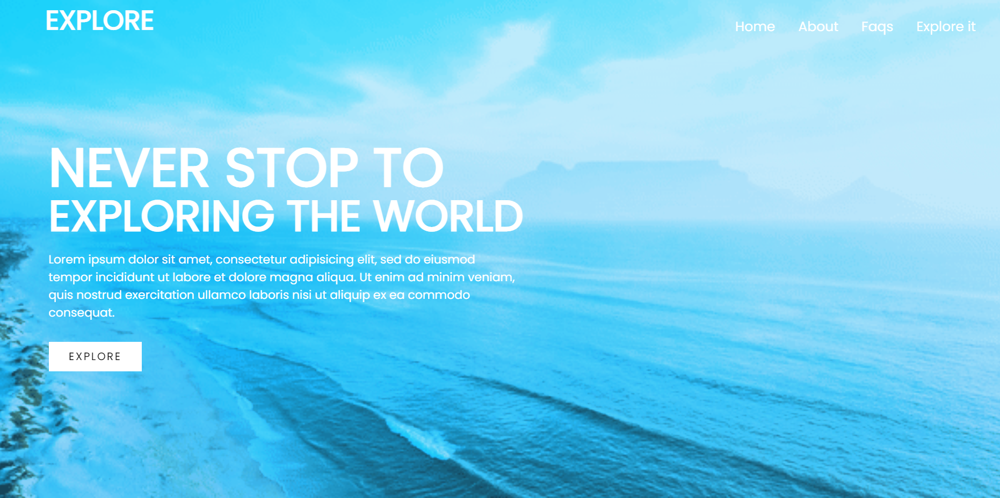

<h1 align="center"> Landing page with dynamic background : Explore </h1>

## Project Description:
I designed a landing page with dynamic background.

>It Depicts a landing page for travel blog

## Project Demo URL: 
<a href="https://iamrahul8.github.io/Landing-Page/"> Demo Link </a>

<h1 align=""> Tools used :</h1>

  

<h1 align=""> Website UI </h1>
<h3> Homepage </h3>

>Submission Under SSOC'22

