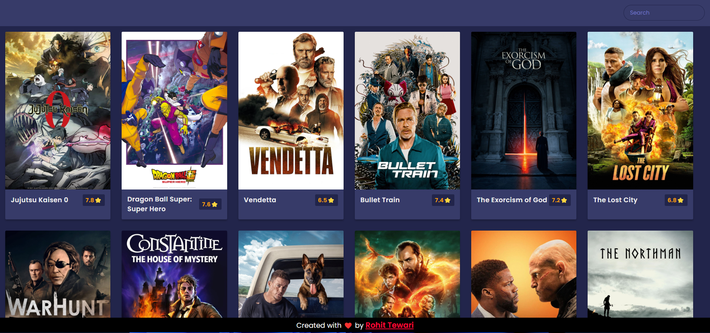

# Movie Searching App

A simple Web Application that allows users to search for movies and view details about the film. It uses TMDb API to fetch movie lists depending upon user queries.

<!-- ##  Home Page View :

 -->

## Features
- Fully responsive UI
- Find out the latest trending movies or search for a movie
- Get overview and rating of any movie

## Tech Stack used

### Frontend

### Backend

No backend required
  
## Developer

[Rohit Tewari](https://www.github.com/rtewari056)
