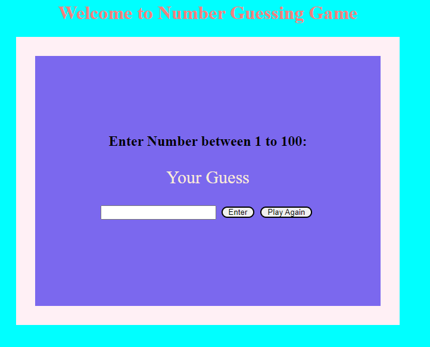

# Number Guessing Game
In this game the player have to enter a number between 1 to 100. If the guessed number is less than the answer,"your guess is too low" will be shown,if it's high then "yout guess is too high" will be shown,if anything other than number is used,"enter numbers only will be shown".
# Tech Stack Used:
1. HTML baisc
2. CSS Basic
3. Vanilla JavaScript
## ScreenShot
