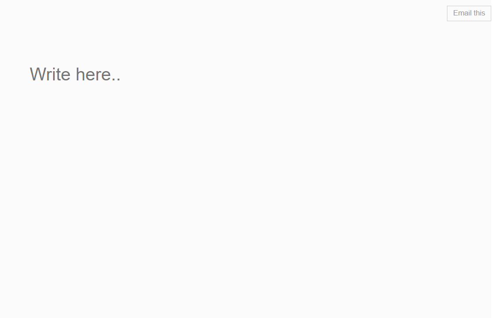

# Online Notepad📝
A basic realtime notepad, made with HTML, CSS and Javascript.

## Table of contents
- Design and Layout (Landing Page)
- Features
- Built using
- Developer

## Design and Layout (Landing Page)

This Notepad is a simple responsive design that contrasts the body backdrop with a single container.

In the links below, you can see pictures of the actual design that was used.
<details>
<summary> Landing Page View :</summary>
<br>

</details>


## Features
<ul>
<li>Responsive design</li>
<li>Email button</li>

</ul>

## Built using

<b>Frontend</b>


<b>Backend<b>
<ul>
<li>No backend required</li>
</ul>
  
## Developer

  <a href="https://github.com/iamrahul8" > Rahul Kumar </a>
  
  ## Licence
  Contribution under SSOC'22
  
  ```
  MIT License

Copyright (c) 2022 Rahul Kumar

Permission is hereby granted, free of charge, to any person obtaining a copy
of this software and associated documentation files (the "Software"), to deal
in the Software without restriction, including without limitation the rights
to use, copy, modify, merge, publish, distribute, sublicense, and/or sell
copies of the Software, and to permit persons to whom the Software is
furnished to do so, subject to the following conditions:

The above copyright notice and this permission notice shall be included in all
copies or substantial portions of the Software.

THE SOFTWARE IS PROVIDED "AS IS", WITHOUT WARRANTY OF ANY KIND, EXPRESS OR
IMPLIED, INCLUDING BUT NOT LIMITED TO THE WARRANTIES OF MERCHANTABILITY,
FITNESS FOR A PARTICULAR PURPOSE AND NONINFRINGEMENT. IN NO EVENT SHALL THE
AUTHORS OR COPYRIGHT HOLDERS BE LIABLE FOR ANY CLAIM, DAMAGES OR OTHER
LIABILITY, WHETHER IN AN ACTION OF CONTRACT, TORT OR OTHERWISE, ARISING FROM,
OUT OF OR IN CONNECTION WITH THE SOFTWARE OR THE USE OR OTHER DEALINGS IN THE
SOFTWARE.
```
  <br>
  

