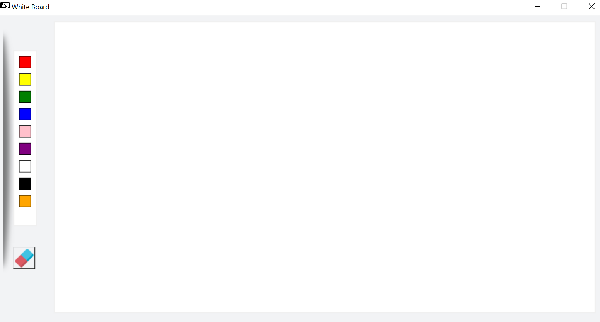

# Digital WhiteBoard

## Description
 A virtual whiteboard is a digital application that functions like a traditional whiteboard, but is hosted virtually. 
 Digital whiteboards can integrate with other video conferencing and screen sharing platforms to allow for collaboration
 even when you are not physically in the same room.
 It consists of different colors that can be used to write anything.
 It also has a eraser button that will clear the screen.
## Technology used
Python
## Screenshots

