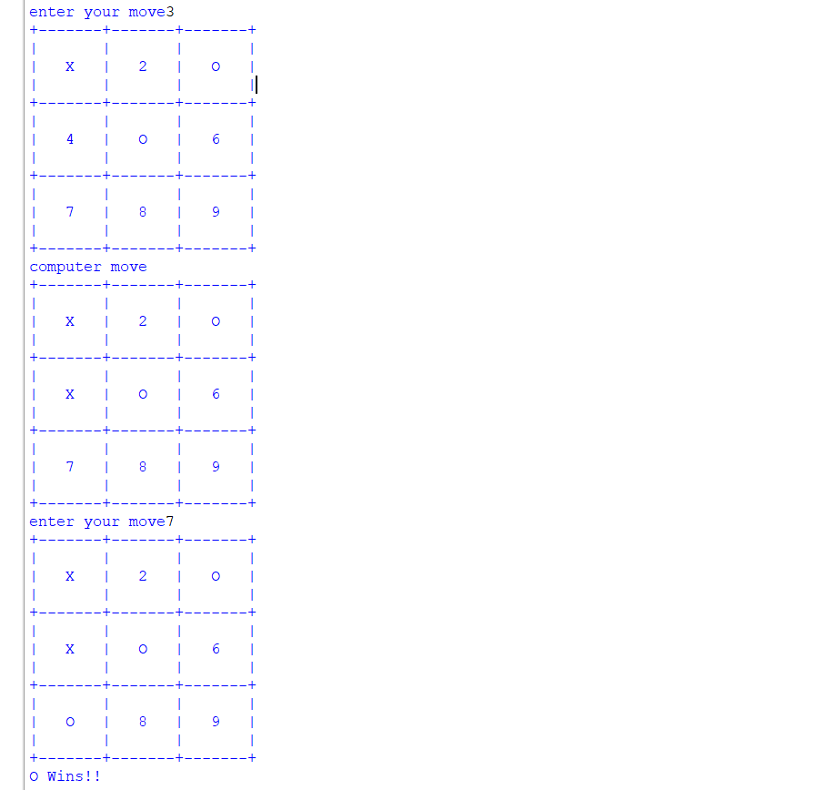

# Tic Tac Toe Game using Python
This game is made using python . This game is played against the computer.

###  How to Start?  

Simple download and run the code.

## Library used?

There is no library used. This game is developed using functions in Python.

##Preview

