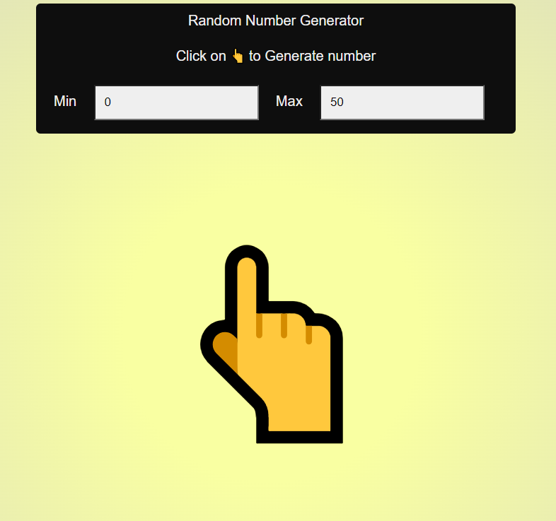

# Random Number Generator
You can generate random numbers by specifying the ranges.

## Technologies used :
- HTML
- CSS
- Js

## Deployment screenshot/Link:

[Demo](https://iamrahul8.github.io/Random-Number-Generator/)

 

>Submision under SSOC'22
