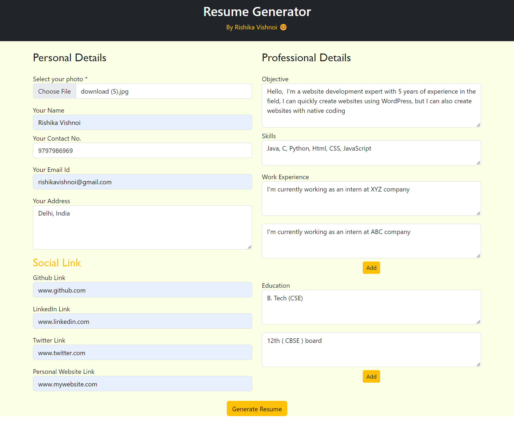
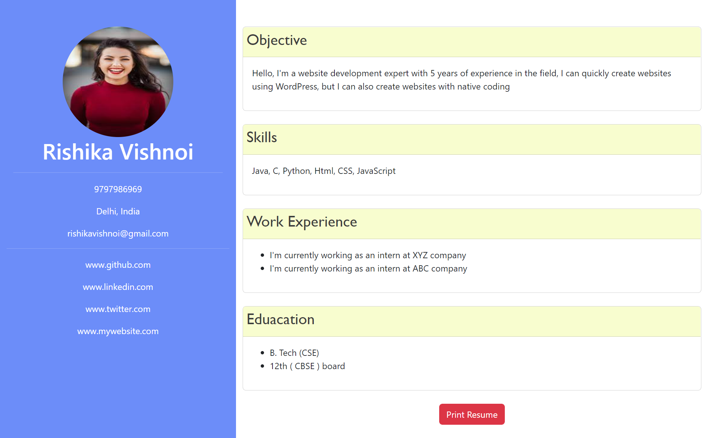

# Resume-Builder ✌️✌️✌️
It is a resume generator web app which can build your resume by just simply fill the form of information
You can also  print it also in pdf format 
Tech used :- HTML , CSS , JAVASCRIPT ,BOOTSTRAP

Working 
-  Fill the form 
-  Click to Generate Resume
-  Click to print and Download it 

### Features
- Add button is used to add as  many Work experience  section
- Add button is used to add as  many Education  
- Print button to download resume
- Clean Code 
- Profile photo , email , phone no , contact no , github link , linkedin link , education , experience, skill , objective section included in the template. 

# [DEMO](https://rishikavishnoi.github.io/Resume-Builder/)  
** Note :- profile photo field is required **

## contibute under SSOC 

