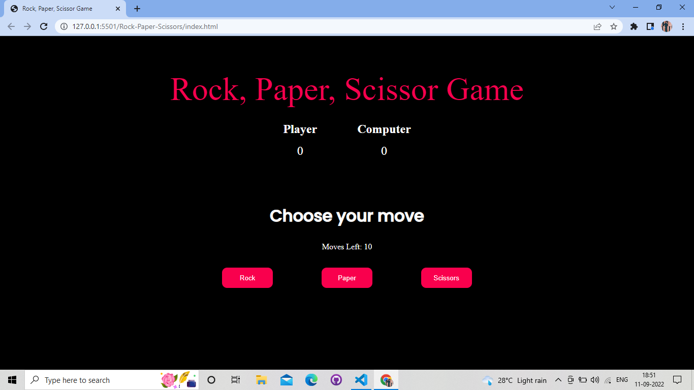
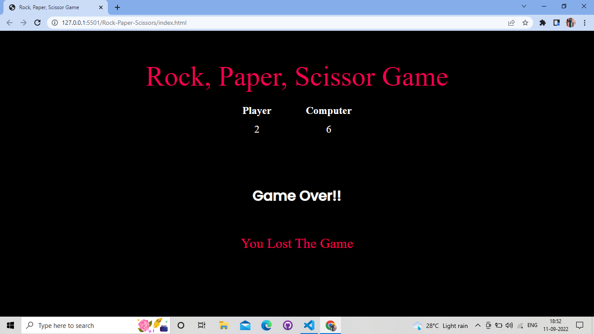

# Rock, Paper, Scissor Game
In this game, there will be 2 players: the user and the computer. The user will get three options to choose from: rock, paper, and scissors, respectively. There will be 10 chances and then the result will be declared.
# Tech Stack
HTML , CSS and JavaScript
# Screenshots

