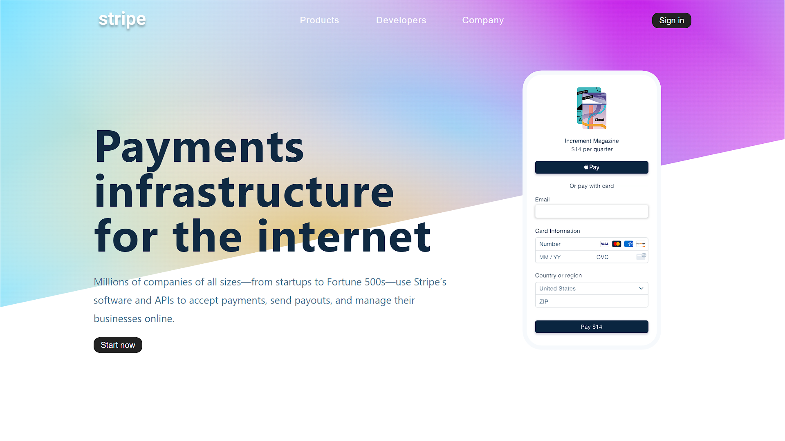

# Stripe Payment Platform UI Clone

This is a UI clone of Stripe which is inspired by the actual Stripe Payment Platform.

##  Home Page View :

## Features

- Responsive UI
- Users can add additional features according to their need

## Tech Stack used :

### Frontend

### Backend

No backend required
  
## Developer

[Rohit Tewari](https://www.github.com/rtewari056)
