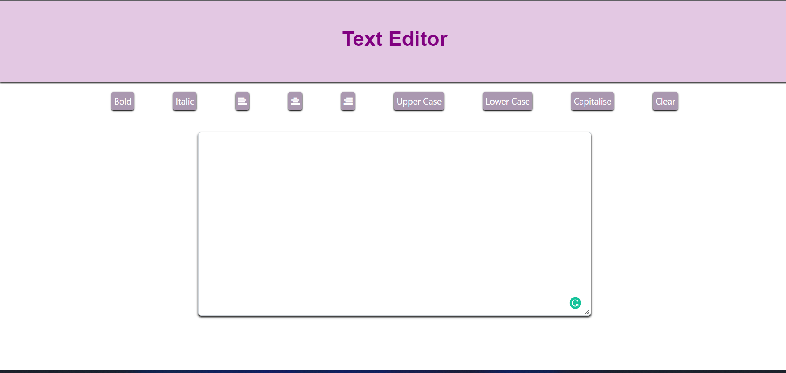

## TexT-Editor

Simple Text Editor is a simple text editing project in JavaScript where we can manipulate the user input in different styles, edit the input, capitalize, etc many string operations. 

## Tech Stack -
HTML ,CSS ,JAVASCRIPT, BOOTSTRAP 

## Approach:

-Create buttons to perform operations on text in div. 
-Create textarea in div using textarea tag. 
-Select elements using document.getElementById method. 
-Then change the CSS using JavaScript.

## Screenshot

## Submission Under SSOC 22
